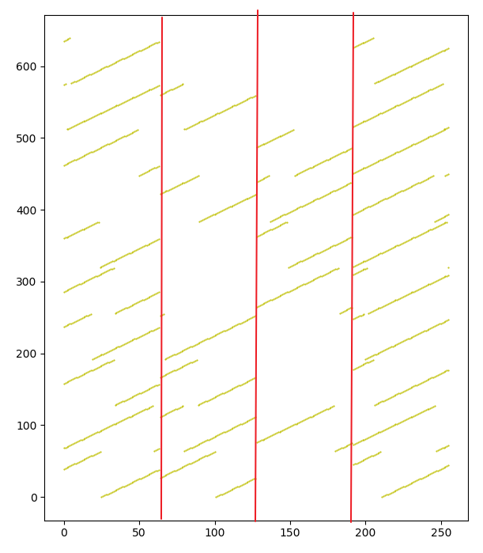

## 解题思路

1. 刚开始对题意有一个初步的了解。要求的是最大的数量，所以跟每人准备的数量无关，而是只跟朋友关系的复杂程度有关。
2. 将部落中的每个人进行编号，按正负区分部落。用数组记录礼物传递的路径。
3. 用深度优先搜索来对礼物传递路径进行搜索。但是搜索的效率很低，只能对环长为4和6的路径进行搜索。
4. 在深度优先搜索的同时进行去重，包括路径内部不重复的内去重和路径之间不重复的外去重。
5. 尝试剪枝策略，比如记录路径中的第一个和第二个节点的编号，并对其在之后的路径中进行处理。可以搜索到环长为10的路径。
6. 将搜索一整个路径分解为搜索两个半路径，然后拼接起来。可以对14环进行搜索了。去重策略又多了一个半路径的内去重。
7. 寻找数据中的规律，发现了邻接矩阵是由多个等间隔的分块矩阵构成的，而且每个分块矩阵都可以通过矩阵中第一个点的平移得到。
8. 利用规律，对每个分块矩阵，先对第一个节点进行搜索，在此基础上对该分块矩阵中的每个节点进行去重。
9. 优化规律的使用，利用有序等特点，更换数据结构等对细节进行优化。

## 代码解读

1. 读入数据，定义全局变量。

   ```python
   # 记录程序开始的时间，读取csv数据
   time0 = time.time()
   file_path = r"../data/part2/5.8/Example.csv"
   table = []
   with open(file_path, 'r') as f:
       reader = csv.reader(f)
       for row in reader:
           table.append(row)
   # 定义全局变量
   global number 
   global head  
   global interval
   global l 
   global s  
   aims = [2, 3, 4, 5, 6, 7] 
   countall = [] 
   l, s = {}, {}
   # 将邻接矩阵转换为邻接表
   source = [[] for i in range(len(table) + len(table[0]) + 1)]
   for i in range(len(table)):
       for j, v in enumerate(table[i]):
           if v == '1':
               source[i + 1].append(-j - 1)
               source[-j - 1].append(i + 1)
               
   def get(num):
       return source[num]
   ```

   - number：半路径的长度，环长的一半。
   - head：头结点的编号，A部落为正、B部落为负，从1/-1开始。
   - l：字典，存储头结点开始找到的环，键为升序排列的元组。
   - s：字典，存储头结点开始找到的半路径，键为路径的结束点编号，值为升序排列的数组。

2. 根据不同的数据大小，判断数据间隔。

   ```python
   if len(table) == 1344:
       interval = 192
   elif len(table) == 256:
       interval = 64
   index = [1]
   for i in range(1, int(len(table) / interval)):
       index.append(interval * i + 1)
   ```

   - 数据规律：无论横竖，数据集都可以看作是长度为一个间隔的分块矩阵。以将矩阵横向按间隔划分为例，矩阵中的排列仅由每个分块中的第一个点确定。矩阵中其他点的位置取决于其上一个点的y值加1，如果前一个点的y值是间隔的倍数，则得到的下一个点的实际y值为加1后再减间隔值。（以间隔为64为例，点（5，-64）的下一个点为（6，-64-1+64）（部落A、B中的邻接表中加减相反））

   - 利用这个规律，我们只需计算出每个分块矩阵中第一个点为头结点时的环数，就可以计得该分块矩阵中的点为头结点时的所有有效的环数。

   - 从图中可以看出，每个区域中，都有两个半斜线可以拼接为一根完整的斜线。

     

3. 循环进行所有环长的搜索。

   ```python
   for x in aims:
       count = 0  # 初始化不同长度的环的数量
       for p1 in index:  # 不同区域的起始点
           p2 = p1 + interval - 1  # 不同区域的终点
           number = x  # 设置环长度、头节点，并进行传递
           head = p1
           count += convert(p1, p2)
       countall.append(count)
   ```

   - 只需计算每隔一个间隔的点为头结点的情况。
   - 传入`convert()`函数的值为该分块矩阵的起点和终点。

4. 调用的函数。

   - `convert()`函数。

     ```python
     # 对编号为 num 的村民的礼物进行传递
     def convert(num, p2):  # A:1开始的正数  B:-1开始的负数
         thiscount = 0   # 遍历该节点所有的长度为环长一半的路径，称半路径
         path = [num]  # 初始化路径
         DFS(num, number, 0, path)  # 开始搜索
         for k in s.keys():  # 遍历存储半路径的 s 字典
             for i, m in enumerate(s[k]):  # 字典的键为半路径的最后一个节点编号
                 for n in s[k][i + 1:]:  # 在同一个键内部的数组进行匹配
                     if repeat(m, n):  # 二者的交集只能为半路径的头尾
                         c = m + n + [head, k[0]]  # 拼接
                         c.sort()  # 排序标准化
                         thiscount += checkIn(tuple(c), num, p2)  # 校验该环是否已经找到
         s.clear()  # 遍历完从一个节点出发的半路径后清空 s，更换头节点
         l.clear()
         return thiscount
     ```

     - 按照传入的头结点编号，传入函数`DFS()`进行深度优先搜索，搜索半路径。
     - 搜索出的半路径，存储在字典 s 中。按照 s 的键为尾节点进行拼接。
     - 清空 s 和 l ，返回该分块矩阵中计得的环数。

   - 函数`DFS()`。

     ```python
     def DFS(num, length, depth, path):
         if depth == length:  # 如果达到期望的路径数组，将其排序标准化后，
             # print(number*2, " ", path)  # 存入 s 字典，键为半路径的尾节点（如果该半路径未被找到）
             tr0 = tuple([path[-1]])
             temppath = path[1:-1] + []
             temppath.sort()
             if tr0 in s.keys():  # 判断该半路径是否已经被找到
                 if temppath not in s[tr0]:
                     s[tr0].append(temppath)
             else:
                 s[tr0] = [temppath]
             return
         for j in get(num):  # 向下搜索
             if (j < 0 or j > head) and (j not in path):  # 去除半路径中已有的和编号大于头节点的数据
                 DFS(j, length, depth + 1, path + [j])
     ```

     - 对半路径进行深度优先搜索，传入头结点、当前路径长度、期望长度和当前路径。
     - 如果长度符合要求，则存入字典 s 。字典 s 的键为尾节点。
     - 存入字典前 s ，先进行排序，并判断该尾节点和该路径是否已经搜到。
     - 深度优先搜索，排除小于头结点和已经在现有路径中的编号。

   - 函数`repeat()`。

     ```python
     def repeat(m, n):
         for i in m:
             if i in n:
                 return False
         return True
     ```

     - 判断两个数组中是否有重复元素。

   - 函数`checkIn()`。

     ```python
     def checkIn(c, p1, p2):
         if c not in l.keys():
             l[c] = ''
             return checkdiff(c, p1, p2) + 1
         return 0
     ```

     - 将所有环按其升序排列的元组为键，存储到字典并进行校验。
     - 如果已经存在，则不计数。
     - 如果还未搜到，则进入`checkdiff()`函数计算该环在该分块矩阵能衍生出多少个环。

   - 函数`checkdiff()`。

     ```python
     def checkdiff(c, p1, p2):  # 判断这个环能衍生出多少有效环
         max_num = p1 - 1
         for i in c[number:]:  # 排序好的数组，前半部分是负的，不需要比较
             if i > max_num:  # 判断是否在范围中，越过右边界则不再比较
                 if i > p2:
                     break
                 max_num = i
         return p2 - max_num
     ```

     - 传入的是一个未被搜到过的环，分块矩阵的起始点。

     - 这个函数的依据为：

       1. 在深度优先搜索中，我们剪枝了编号小于头结点的点。这意味着，后边搜出的环，如果在以同一个头结点开始搜索的环字典中没有重复，那么也不会与之前较小编号的头结点开始搜到的环重复。

       2. 只搜索分块矩阵起点为头结点的环，就可以知道这个分块矩阵中从起点到终点为头结点可以生成的所有环数。

       3. 得出2的理由，是基于间隔的分块矩阵的规律。从1中可知，在起点后的点为头结点时，可能出现重复的唯一情况是：因为加1之前为间隔的倍数，加1后被减去一个间隔，导致路径中存在小于头结点的编号的点。

       4. 例：

          ```html
          对于一个头结点为1的路径：
          [1, -56, 64, -98, 1]
          则头结点2中必有一个路径会搜索到的前三个点编号为：
          [2, -57, 1...]
          在路径中存在小于头结点2的编号1，该路径已经重复
          ```

     - 基于以上依据，我们只需要找到，该路径中，值位于该分块矩阵中起点编号和终点编号之间最大的数，用终点编号减去该数，即为起点为头结点时该路径可以衍生（平移）出的环数。

       - 例：

         ```html
         对于一个头结点为1的路径：
         [1, -56, 63, -98, 1]
         则只能衍生出：64 - 63 = 1 个不重复的环
         ```

     - 同时，由于传入的路径是排序好的数组，前半部分编号为负，不需要比较。同样的，大于终点编号后，也不需要再比较。
   
5. 优化：搜索和去重的效率较低，应该有更为快速的方法。

