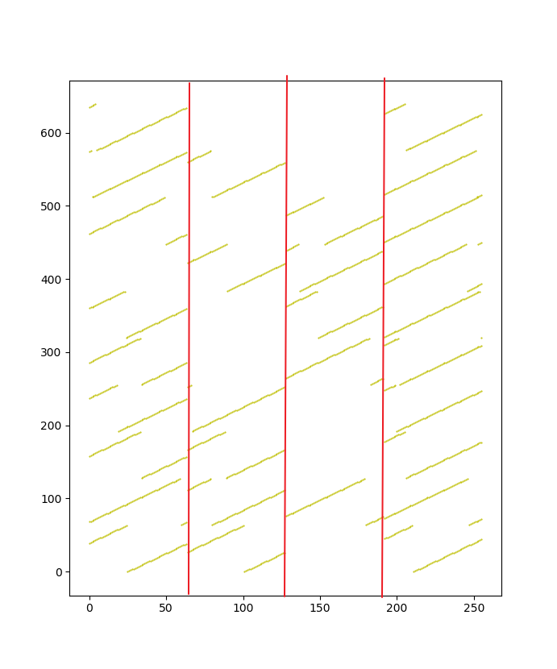
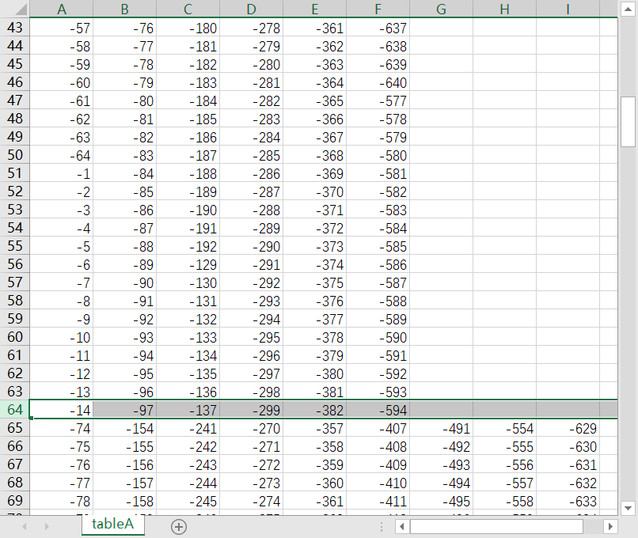
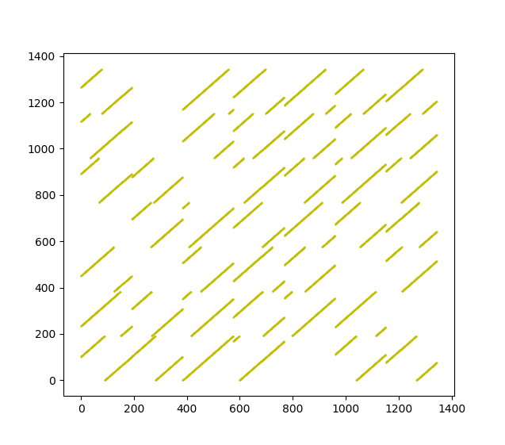

# 傅里叶派-代码思路

## 1、赛题理解

- 通过对赛题的大致理解，题目含义大概是，寻找图中的指定长度的环的数量、。
- 规则2/3："每个人可以准备的祭品数量不限"，，"可以接收的祭品数量不限"。表示题目因为问到的是最大，所以答案与祭品的初始数量没有关系。
- 规则3："传递给自己在对方部落里的好朋友们"。表示部落 A、B中的节点必须交替传递。而且准备礼物的人最开始不在木托盘上刻自己的名字。
- 规则4："收到祭品的人必须在盛放此祭品的木托盘上刻上自己的名字"。表示礼物向下的传递规则，并且会记录路径信息。
- 规则5/6："如果祭品回到最初准备此祭品的人手中，此人也在木托盘上刻上自己的名字之后，终止传递"，"木托盘上不允许出现重复的人名"。表示结束条件是礼物回到准备的人或传递过程中经过一个人两次。
- 条件1："此祭品回到了最初准备它的人手中"。表示有效的终止条件是礼物回到准备的人，传递过程中经过一个人两次是无效的需要剔除的。
- 条件3："不区分名字的排列顺序"。表示了环的重复的规则，即只考虑内容不考虑顺序。

## 2、环境配置

- 集成开发环境：PyCharm 2019.1.3 社区版。
- 语言环境：Python 3.7.7。
- CPU：Intel i7 8750H。

## 3、代码思路

> 以下包括两方面的代码思路，第一部分是对之前4.13提交的代码的优化，第二部分是利用数据规律编写的新代码。

### （1）之前代码优化

1. 理解题意，将题目抽象。

   - 给出的数据是邻接矩阵的形式，但是是可逆的，也就是说朋友关系是相互的，是无向图。
   - 节点集可分为两个集，在集内部之间没有边，是二分图。
   - 由于本专业为机械工程，对通信和数据结构没有深入了解，只能尝试用简单方法进行。有人类比了该结构类似 LDPC 中的 Tanner 图。

2. 处理输入数据。

   - 数据格式是邻接矩阵，在实际遍历时，我们需要很快的知道某一个节点组成的边连接的是哪些节点。因此在最先，将邻接矩阵转换为邻接表。
   - 对节点进行编号可以选择按大小区分 A、B 部落，但是使用正负分辨，正为 A 部落中，负为 B 部落中，感觉更为形象。
   - 由于索引从 0 开始，这样A、B中都有 0 。为了避免重复，将编号的绝对值加一。即A中编号为 1~256，B中为 1~640。
   - 创建获取节点连接列表的函数，按照正负分别索引 A、B 的邻接表。

3. 进行路径搜索。

   - 如果直接进行长度为 14 的路径的深度优先搜索，搜索和查重都会较慢。但是如果只对长度的一半进行长度为 7 的路径的深度优先搜索，效率会有很大提高。这种路径下称半路径。
   - 具体步骤是，从某一个节点出发，进行长度为 7 的路径的深度优先搜索，搜索到的所有路径按其尾部的最后一个节点（尾节点）的编号为键存入字典。
   - 进行匹配时，在同一个键对应的值中，以数组形式存储了所有以该键为尾节点的半路径，比较两个半路径的交集只有半路径的头、尾节点，则可认为构成了一个环（可能重复）。
   - 半路径搜索的基本原则包括：
     1. 如果下一个结点的编号已经在路径中，则不向该节点传递。
     2. 如果满足1，还需要下一个节点的编号大于头节点。因为编号小于头节点编号的节点一定已经被遍历过，如果经过该结点有环，也已经被记录了。
     3. 因为无向图节点间的关系是可逆的，只需要变量A中的节点。
     4. 总而言之，最基本的去重思想就是，对于一个环，从组成环的每一个节点出发都可以搜索到这个环，但总共只记一个。
   - 直接使用半路径搜索，解决了部分去重的问题。也就是说，这样搜索到的都是有效的环（环中无重复节点），但是还可能出现环的元素重复的问题。

   > 优化1：对于两个半路径的拼接时，判断两个半路径中是否除了头尾节点没有重复元素有多种方式。之前使用的是将两个半路径转换为集合，其交集为头尾节点，效率较低。尝试了集合交集元素数为2、编写函数等。最后选择半路径中不含头尾节点，头结点作为全局变量 head，尾节点作为字典的键。拼接前判断两个数组中没有重复元素，用一个简单函数 repeat 实现。
   
4. 进行环的去重。

   - 进行整体上环的去重，需要先确定环的标准型。在这里定义环的标准型为路径的升序排列。
   - 直接将所有路径都进行比较是否重复效率很低。这里使用 Python 中的字典的键进行分类。字典的键为标准化的路径后路径的前 4个节点的编号。这样只需要比较在一个键对应的值中是否有重复。
   - 如果字典的键的节点数越多，键对应的值规模也就较小，比较较快。但同时，键的数量增多，对字典的索引可能变慢。

   > 优化2：之前对整体上环去重，将标准化的路径后路径的前 4个节点的编号作为键。思考了使用节点作为编号的节点数量，尝试了环长的一半等多种设置，最后发现字典对键的索引效率其实很高，可以直接将数组调用 `__str__()`方法存入字典的键中。之后判重只需要`新数组 not in l.keys()`即可。

   > 优化3：字符串和元组都是可哈希的，字典的键实际上是HashMap。经过测试，将键存为元组比存为字符串索引更快。

5. 结果。

   - 总的来说，就是将一个环拆成两段。从一个节点出发搜索所有可能的半路径，如果尾节点相同就可以拼接，最后再去重。

   > 对已下载的数据进行长度 4~14个的环的搜索，时间大概在 35~50s。

   

   - 以4月21日数据为例：

     | 祭品上的名字数 | 该名字数下的祭品数 | 所用时间(m:s) |
     | -------------- | ------------------ | ------------- |
     | 4              | 64                 | <0: 0         |
     | 6              | 448                | <0: 0         |
     | 8              | 4928               | <0: 0         |
     | 10             | 46848              | <0: 0         |
     | 12             | 613440             | 0: 3          |
     | 14             | 6862464            | 0: 39         |

### （2）利用数据规律的新代码

1. 对数据进行观察。

   - 对4月21日的数据进行绘图可得：

     

   - 可以看出从A部落（x轴）可以讲数据分为四个部分。其中，从下向上，按顺序的两条线都可以拼接，组成这个区域内B部落向A部落的映射，并且覆盖了整个A部落的区域。

   - 继续观察，将邻接表打印到表格中可得：

     

   - 可以看出，对于A部落，每个区域的长度都是64，而且对于区域中的数据，绝对值没有达到64的倍数之前，是按序每次绝对值增加1。

   - 绝对值达到64的倍数后，下一个元素的数据绝对值会减少63（即+1-64）。

   - 按照这个规律，四个区域的信息实际上可以由每个区域中的第一个点唯一确定。即知道第1、65、129、193个点的邻接点后，就可以推知图中所有点之间的关系。

   - 同样的，对于部落B也有相同的规律。

2. 代码构思。

   - 对于第1、65、129、193个点，仍然需要使用半路径的深度优先搜索加拼接的方法，找出通过该点的所有环。

   - 对于其他的点，以点2为例，将点1的所有环中的数据加1即可得到点2可能的环的父集，仍然需要做去重的工作。

   - 可以将点2可能的环像之前一样，使用字典的键进行去重，但是每次都要进行整个集合中整个环的计算，效率较低。

   - 找出点1和点2的所有环，以4月18日的数据为例，环长为12的通过点1的环有9392个，通过点2的环有9390个，仅仅相差两个。通过累加从点1传递到点2失效的环为：

     ```html
     [-453, -437, -383, -382, -300, -137, 1, 64, 91, 95, 159, 206],
      [-595, -453, -437, -383, -382, -137, 1, 64, 91, 95, 159, 206]
     ```

   - 注意到两个环中都包含了64。进一步，选择点11和点12。以4月18日的数据为例，环长为12的通过点11的环有8391个，通过点12的环有8343个，相差48个。部分通过累加从点11传递到点12失效的环为：

     ```html
     [-441, -380, -299, -148, -108, -97, 11, 64, 88, 99, 170, 210],
      [-441, -382, -310, -299, -217, -108, 11, 64, 99, 105, 172, 210],
      [-526, -441, -329, -299, -108, -97, 11, 64, 99, 101, 210, 237],
      [-605, -441, -382, -299, -217, -108, 11, 64, 99, 105, 172, 210],
      [-605, -441, -299, -200, -108, -97, 11, 64, 88, 99, 210, 246],
      [-594, -524, -380, -148, -108, -97, 11, 64, 88, 99, 170, 235],
      [-594, -524, -310, -299, -217, -108, 11, 64, 99, 105, 172, 235]
     ```

   - 对其他点进行测试也有类似的结果。猜想是当点累加到64的倍数时，再累加就会触发数据的特点，绝对值减少64，导致无法连续。

3. 具体实现。

   - 这样，我们就只需要判断数组中是否有累加后到达64的倍数的节点即可。

   - 这个规律可以反推回去，这样就不需要每次将新得到的环数据进行存储，而只需要对每个区域内的第一个头结点的环进行判断即可，节省了额外的空间和计算、拷贝的时间。

   - 使用这个函数，就判断了这个头节点中的环 c，在点 head（全局变量）中是否有效。返回值用来判断这个环是否是有效的，如果有效就count+1，失效则置其标志位为False。count 为现在找到的指定长度的环的数量。s1为存储头结点中找到的环的数组。

     ```python
     def checkadd(c, p):
         if (p * 2 - head - 62) in c:
             return False
         return True
     
     for index, j in enumerate(s1):      
         if flag[index]:                
             if checkadd(j, p2):        
                 count += 1
             else:
                 flag[index] = False
     ```

   - 如果每次传递失效后，对头结点的环数组中的对应项进行删除需要耗费比较长的时间，可以通过一个标志数组作为 flag，将已经失效的环标记为 False，之后不再进行遍历。

   - 头结点的环的遍历仍然采用之前的方法。

4. 结果。

   - 总的来说，利用数据的规律，减少去重的操作。

   > 对已下载的数据进行长度 4~14个的环的搜索，时间大概在 5~10s。

   

   - 以4月21日数据为例：

     | 祭品上的名字数 | 该名字数下的祭品数 | 所用时间(m:s) |
     | -------------- | ------------------ | ------------- |
     | 4              | 6                  | <0: 0         |
     | 6              | 448                | <0: 0         |
     | 8              | 4928               | <0: 0         |
     | 10             | 46848              | <0: 0         |
     | 12             | 613440             | <0: 0         |
     | 14             | 6862464            | 0: 5          |

   - 对环长为16进行了尝试，通过时间 1:27 ，共找到 84069152 个环。

### （3）、对依照数学规律的代码的进一步优化

1. 优化思路：
   - 因为理论上说，已知这四个点的邻接点，所有长度的环数就都已确定。
   - 因此，对于已经找到的、过这四个点的环，不需要对其进行多次遍历，而只进行一次遍历就知道这个环会在什么时候失效，进而计算出这个环可平移出的有效环的个数。
   - 进一步的，也不需要对环以数组形式进行存储，以字典的键的形式进行存储只是为了去重。可以在每个环刚刚被找到时就对其进行平移计算，这样也不需要对环进行二次遍历了。
   - 这样也不需要标志位，只需要找出当前数组中在当前区域内最大的元素，即可判断出该环平移衍生出的有效环数量。

2. 具体实现：

   - 通过起点所在的区域，判断该环能衍生出多少有效环。

     ```python
     def checkdiff(c, p1, p2):
         max = 0
         for i in c:
             if i in range(p1 - 1, p2 + 1):
                 if max < i:
                     max = i
         return p2 - max
     ```
     
   - 事实上，经过测试，这个`checkdiff()`函数比较费时间，而且其遍历了每个数组，对其进行小优化也可节省时间。

   > 优化1：因为数组是有序的，首先前半段是负的，不需要进行比较。其次，如果越过了右边界p2，也没有必要比较了。
   >
   > ```python
   > def checkdiff(c, p1, p2):
   >     max = p1 - 1
   >     for i in c[int(len(c)/2):]:        
   >         if i > max:         
   >             if i > p2:
   >                 break
   >             max = i
   >     return p2 - max
   > ```
   >
   > 这样时间大概减少了1/3，在0.9~2.5s。4.26日数据，环长16的也在11s左右。环长4~ 14勉强进1s内。

   > 优化2：对读取数据文件进行优化，只对文件进行一层遍历，并且用一个数组存储邻接表，减少了判断。时间大概减少了0.1 s。用直接读csv代替用numpy读，时间减少了。而且int类型的强制转换也比较耗费时间，将全局变量number定义为半路径的长度，不需要除2后强制类型转换，时间减少。

3. 结果：

   - 总的来说是对遍历操作进行了简化，减少了空间的使用和时间上无谓的计算。

   > 对已下载的数据进行长度 4~14个的环的搜索，时间大概在 0.8~2 s。

   - 以4月26日数据为例：总运行时间 0.88 s。

     | 祭品上的名字数 | 该名字数下的祭品数 | 所用时间(m:s) |
   | -------------- | ------------------ | ------------- |
     | 4              | 128                | <0: 0         |
     | 6              | 320                | <0: 0         |
     | 8              | 3712               | <0: 0         |
     | 10             | 44352              | <0: 0         |
     | 12             | 563200             | <0: 0         |
     | 14             | 6393856            | <0: 0         |
   
   - 对环长为16进行了尝试，通过时间 10 s ，共找到 75580992 个环。

   - 对环长为18进行了尝试，通过时间 190 s ，共找到 896152640 个环。

### （4）初赛第二阶段的代码优化

- 初赛第二阶段的数据集增大，规模变为 1344×1344 的矩阵。且第二阶段赛题中明确指出，程序必须要对第一第二阶段的数据进行自适应。

- 首先，先画出新的数据集的分布：

  

  可以看出，新的数据集只是增大了容量，原有的数据规律没有发生变化，只是间隔从64变为了192。

- 因为数据的间隔必然是与数据截断时的绝对值减小的大小是一致的，自适应获取从第一个数据开始的绝对值减小的大小作为间隔即可。

  ```python
  temp = get(1)
  origin = get(1)[0]
  for i in range(2, len(table)):
      if get(i)[0] != temp[0] - 1:
          interval = get(i)[0] - temp[0] + 1
          if (temp[0] - 1 - origin) == interval:
              break
          else:
              interval = abs(temp[0] - 1 - origin)
              break
      else:
          temp = get(i)
  ```

  其中，intervel 为数据间隔，index 为每个区域开始部分的起点。

- 5月2日的数据集，测试出了原来判断间隔的程序的BUG。即如果第一条线没有中断，那么下降就是在第一个区域结束，测出的间隔就出现错误了。如果要完全消除此类BUG需要对整个数据集遍历一次，比较麻烦。最后还是直接用数据集大小判断两个阶段的数据集。

- 结果：

  - 使用5.8日的数据，用时 6.6 s。

  | 祭品上的名字数 | 该名字数下的祭品数 | 所用时间(m:s) |
  | -------------- | ------------------ | ------------- |
  | 4              | 6912               | <0: 0         |
  | 6              | 6144               | <0: 0         |
  | 8              | 44928              | <0: 0         |
  | 10             | 707136             | <0: 0         |
  | 12             | 13834176           | 0: 1          |
  | 14             | 267705792          | 0: 5          |


## 4、优化思路

- 是否有其他的数据结构能够增加部分运算速度。
- 是否能利用数据规律进行进一步的去重优化。

